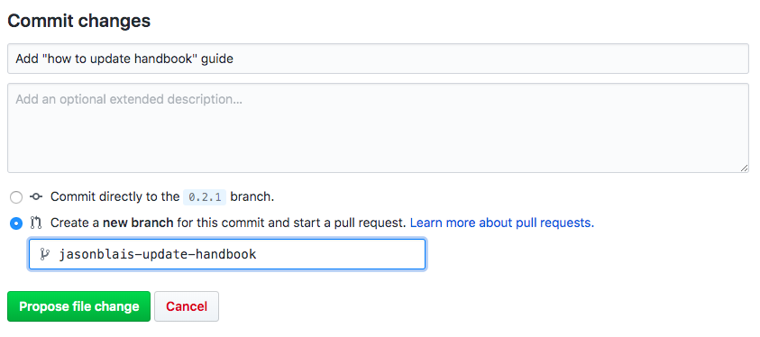
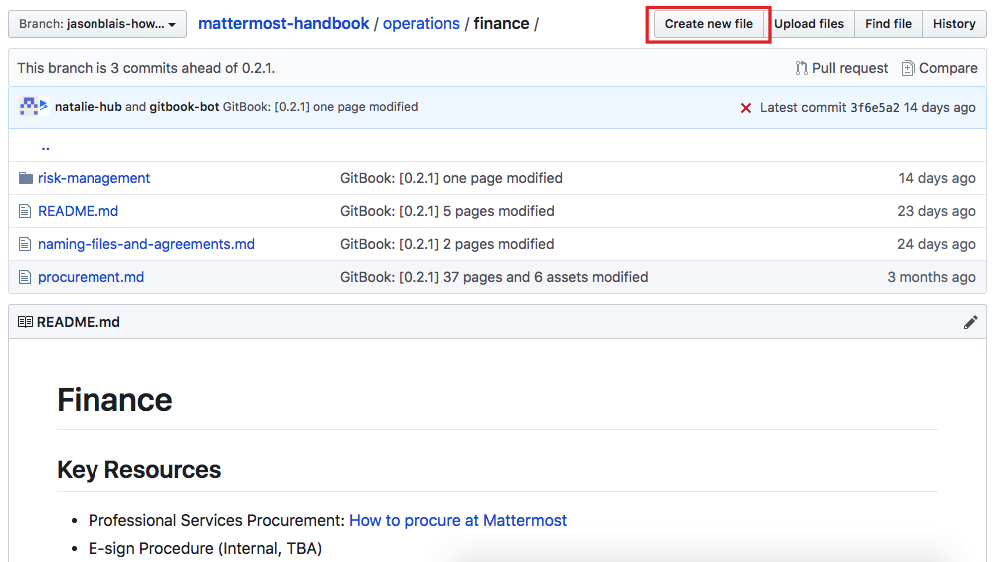

# How to Update the Handbook

## Who can update update the Handbook?

Contributions from everyone, from staff members to community members, are welcome. You don't have to work at Mattermost to submit an update or fix something that's caught your eye.

## How do I know what to update?

"Update the Handbook" is a term we use regularly at Mattermost but it's not always obvious exactly what to update or how. Here are some examples of what a Handbook update could be:

* Updating your team page with new team members and AORs.
* Adding a new page to describe a new process.
* Updating existing content to accommodate a change in process, policy, or requirement.
* Archiving old content that should be preserved for reference.

Updating the Handbook can be as easy as fixing a typo, or as complex as reorganizing an entire section. The key is to update it regularly, so that updates are less daunting and time-consuming.

## Guidelines

The Handbook is a public-facing body of work and although it's a constantly-evolving work-in-progress, we still need to ensure our content is accurate, easy to read, and clear.

* **Be concise:** Say what's essential, not more.
* **Get feedback:** Have someone from your target audience read your draft to share feedback so you can [savor surprises](../about-mattermost/mindsets.md#savor-surprises).
* **Don't aim for perfection:** Our goal is regular iteration and so your content doesn't have to be perfect before it's published. It will be reviewed by an editor prior to publication so any major errors will be addressed then.

## Steps

If this is your first time contributing to Mattermost, first read the [Mattermost Contributor Agreement](https://www.mattermost.org/mattermost-contributor-agreement/) and sign it \(at the bottom of the page\), so you can be added to the Mattermost [Approved Contributor List](https://docs.google.com/spreadsheets/d/1NTCeG-iL_VS9bFqtmHSfwETo5f-8MQ7oMDE5IUYJi_Y/pubhtml?gid=0&single=true). Please ensure the **GitHub username** field matches your GitHub username exactly, including capitalization. Next, please request access to the Mattermost organization [DevOps Team Channel](https://community.mattermost.com/private-core/channels/devops-team).

### Editing an existing page

1. The quickest way to begin is navigating to the page you want to edit in [Mattermost Handbook](https://handbook.mattermost.com/), then clicking the **Edit on GitHub** icon in the top right navigation. This opens the page in GitHub that you can edit.
2. In GitHub click the pencil icon in the navigation bar \(above the page header\) called **Edit the file in your fork of this project** to open the editable Markdown-format page.

  * To learn more about Markdown formatting, see the [Mattermost guide for formatting text](https://docs.mattermost.com/help/messaging/formatting-text.html), or [the guide from GitBook](https://docs.gitbook.com/editing-content/markdown).

3. Make your edits. When you're ready to submit your changes, scroll to the bottom of the page to commit your changes and start a pull request.
4. Add a descriptive title if the default title isn't sufficient. Add an extended description to summarize the changes you've made.
5. Click the **Propose file change** button.



6. On the next page, scroll down to compare changes with the original document and then select **Create pull request**.
7. Confirm that the title and description are correct. Then select **Create pull request**.


Once a pull request has been submitted, a core committer with write-access assigns relevant reviewers and labels to kick off the review process. The review process includes aligning the content with the Style Guide, validating the changes, and tagging any other relevant committers.

Multiple committers may comment on your pull request and provide edits or suggestions which you can commit directly. You can also add line comments. Take a look at [Commenting on pull requests](https://help.github.com/en/github/collaborating-with-issues-and-pull-requests/commenting-on-a-pull-request) for more details.

Once the review process is complete, the change is merged and pushed live. We recommend that you review your changes at [https://handbook.mattermost.com](https://handbook.mattermost.com) for potential formatting errors.

### Creating a new page

Creating a new page follows the same process as above, with two exceptions:

* Navigate to that section of the handbook where you'd like to add the new page and select **Create new file**.
* Add your new page to the [Handbook table of contents](https://github.com/mattermost/mattermost-handbook/blob/0.2.1/SUMMARY.md). If you plan to reorder the table of contents as part of your change, please tag @jason.blais or @justine.geffen in Mattermost (@jasonblais or @justinegeffen in GitHub) as a redirect may need to be set up to accommodate the change.

[Watch a two-minute training video on how to create a new page in GitHub](https://drive.google.com/file/d/12JUpEdP3uU_bPxDVWdlEZv65v1tttlQn/view?usp=sharing).



### Creating a new folder

If you want to create nested content, you can create folders. You cannot create an empty folder and then add files to that folder, but rather creation of a folder must happen together with adding of at least a single file. On GitHub you can do it this way:

1. Navigate to the folder within which you're creating your new folder.
2. Click on **New file**.
3. Enter the new folder's name in the text field and add `/` at the end.
5. In the next text box, enter the name of the new page, ending with `.md`.
6. Select **Commit new file**.
7. Add a descriptive title if the default title isn't sufficient. Add an extended description to summarize the changes you've made.
8. Click the **Propose file change** button.

* Add your new page to the [Handbook table of contents](https://github.com/mattermost/mattermost-handbook/blob/0.2.1/SUMMARY.md).

### Folder and page naming conventions

When you create a new page in the handbook ensure that:

* The page name is all lowercase.
* There are hyphens instead of spaces between the words.
* New page names end with `.md`.

**Note:** Folder names do not end with `.md`.

## Frequently Asked Questions

### How do I format a page?

All Handbook pages are written in Markdown, which is also the language used to post messages in Mattermost. To learn more about Markdown formatting, see the [Mattermost guide for formatting text](https://docs.mattermost.com/help/messaging/formatting-text.html), or [the guide from GitBook](https://docs.gitbook.com/editing-content/markdown).

### How do I update the left-hand navigation?

You can update the left-hand navigation in the [SUMMARY.md](https://github.com/mattermost/mattermost-handbook/blob/0.2.1/SUMMARY.md) file.

**Important note:**

GitBook dynamically changes the URL based on the location in the table of contents. This means that when a page changes its location, the previous link results in a 'page not found' error.

There is a redirect file that we use to prevent this in the `gitbook.yaml` file. Please mention @jason.blais or @justine.geffen in Mattermost (@jasonblais or @justinegeffen in GitHub) for assistance if needed.

### How do I add an image to the documentation?

Follow these two steps:

* Go to the [/assets](https://github.com/mattermost/mattermost-handbook/tree/0.2.1/.gitbook/assets) folder, click **Upload files**, then upload the image files you want to add to your documentation. Make sure to have a clear name for each file you upload.
* Next, go to the section you want to add an image to and include the following Markdown formatting:

  ```text
  
  ```

## Training video

[Watch a training video on how to update the handbook in GitHub](https://drive.google.com/file/d/1AOI8H-oe2u1JW6oOA4nPPTSbGnK3Xuq1/view?usp=sharing).

## Approved reviewers and permissions

Below is a list of approved reviewers.

1. @jasonblais: Reviews major changes to handbook.mattermost.com, such as updates to the Table of Contents (SUMMARY.md).
2. @justinegeffen, @amyblais, @cwarnermm: Editor reviews of all submitted PRs for correct grammar and consistent style.
3. @kevinfayle: Signs off on changes to [marketing ops and analytics](https://handbook.mattermost.com/operations/messaging-and-math/demand-generation-reporting).
4. @aedott: Signs off on changes to [messaging and math](https://handbook.mattermost.com/operations/messaging-and-math).
5. @TQuock: Signs off on changes to [finance](https://handbook.mattermost.com/operations/finance).
6. @natalie-hub: Signs off on changes to [workplace](https://handbook.mattermost.com/operations/workplace).
7. @it33: Signs off on changes to signing authority \([example](https://github.com/mattermost/mattermost-handbook/pull/60)\).
8. @dschalla: Signs off on changes to [Security](https://handbook.mattermost.com/operations/security).

Each PR should be reviewed by at least one approved reviewer. A build check requiring at least one approved review prior to a merge is planned, similar to other Mattermost repositories.

Below is a list of permissions handbook contributors have access to:

1. @jasonblais, @justinegeffen, @amyblais, @cwarnermm: Write permissions to the repository.
2. Staff contributors: Submit changes to handbook.mattermost.com via PRs. May have access to request reviews, add labels, submit PR reviews, and be requested as reviewers.
3. Non-staff contributors: Submit changes to handbook.mattermost.com via PRs. Do not have access to request reviews, add labels. Can submit PR reviews.
